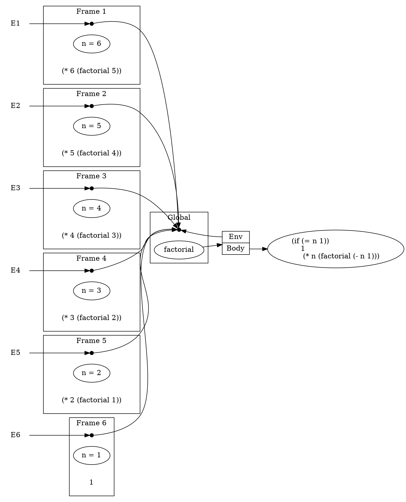
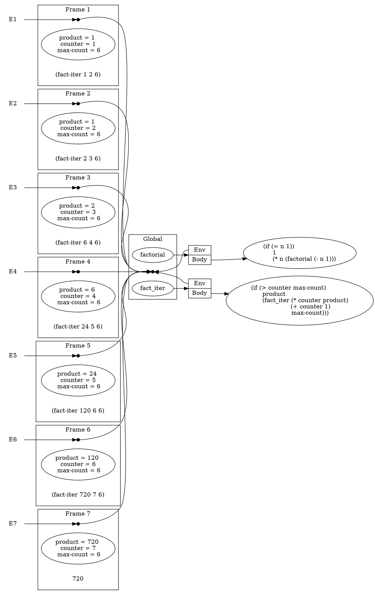
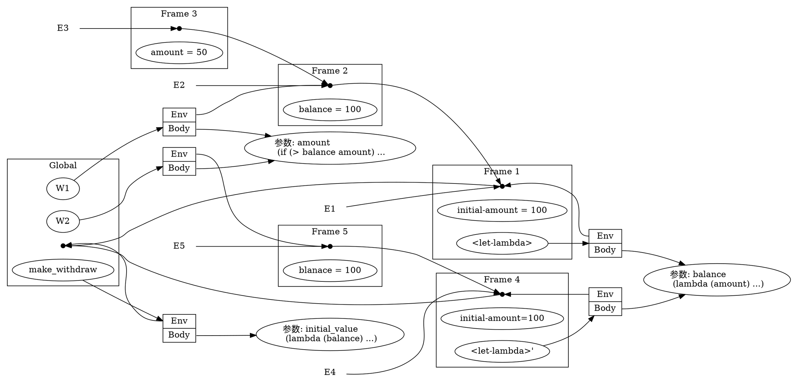
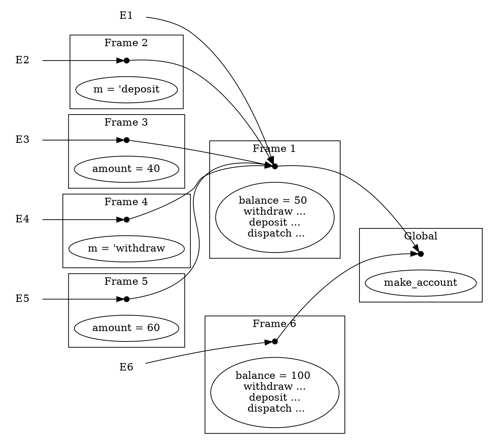

# Concepts
import Todo from "../../components/Todo.astro"
import DotRenderer from "../../components/DotRenderer.tsx"

- Environment: "places" in which values can be stored
- Frames: A table (possibly empty) of bindings, which associate variable names with their corresponding values
- Procedure: a pair consisting of some code and a pointer to an environment
  - Procedures are created in one way only: by evaluating an $\lambda$-expression
  - **Code** is obtained from the text of the $\lambda$-expression
  - **Environment** is the environment in which the $\lambda$-expression was evaluated to produce the procedure

# The Rules for Evaluation

- Rule 1: A procedure object is applied to a set of arguments by constructing a frame, binding the formal parameters of the call, and then evaluating the body of the procedure in the context of the new environment constructed.
The new frame has as its enclosing environment the environment part of the procedure object being applied.
- Rule 2: A lambda-expression is evaluated relative to a given environment as follows:a new procedure object is formed. combining the text (code) of the lambda-expression with a pointer to the environment of evaluation.

# Actions and Identity
- We say that an action. A. had an effect on a object, X, (or equivalently, that X was changed by A) if some property, P. which was true of X before A because false of X after A
- We say that two objects. X and Y, are the same if any action which has an effect on X has the same effect on Y

# 练习 3.9
递归与迭代
```scheme
(define (factorial n)
  (if (= n 1)
      1
      (* n (factorial (- n 1)))))
```

<DotRenderer client:load engine="dot">

</DotRenderer>

```scheme
(define (factorial n)
  (fact-iter 1 1 n))

(define (fact-iter product counter max-count)
  (if (> counter max-count)
      product
      (fact-iter (* counter product)
                 (+ counter 1)
                 max-count)))
```

<DotRenderer client:load engine="dot">

</DotRenderer>


# 练习 3.10
局部状态变量
```scheme
(define (make-withdraw initial-amount)
  (let ([balance initial-amount])
    (lambda (amount)
      (if (>= balance amount)
          (begin (set! balance (- balance amount))
                 balance)
          "Insufficient funds"))))

(define W1 (make-withdraw 100))
(W1 50)
(define W2 (make-withdraw 100))
```
1. 在全局环境中定义 `make-withdraw`， `make-withdraw` 的值可看作一个 $\lambda$ 表达式
2. 对 `make-withdraw` 的 $\lambda$ 表达式求值，得到一个序对，序对的 `Env` 部分指向 `make_withdraw` 所在的全局环境， `Body` 部分指向 $\lambda$ 表达式的代码
3. 在参数 `initial-amount = 100` 上应用 `make-withdraw`，建立一个新框架 `Frame1`，`Frame1` 的外围环境是全局环境，形式参数 `init-amount` 约束于对应的实际参数 `100`，将该框架称为环境 `E1`
4. `make-withdraw` 的的过程体是一个 $\lambda$ 表达式，在环境 `E1` 下求值，得到一个序对（`<let-lambda>` 指向的序对）,其 `Env` 部分指向当前环境 `Frame1`
5. 在参数 `balance = 100` 上应用 `<let-lambda>` ，得到一个新框架 `Frame2` ，并绑定 `Frame1` 为外围环境，并约束 `balance` 的值为 `100`，称该框架为环境 `E2`
6. `<let-lambda>` 的过程体为一个 $\lambda$ 表达式，在环境 `E2` 下求值，得到一个序对，其 `Env` 部分指向当前环境 `Frame2`
7. 将得到的序对作为返回值返回，在全局环境中将 `W1` 绑定到返回值上
8. 在参数 `amount = 50` 上应用 `W1` ，建立一个新框架 `Frame3` ，将 `Frame3` 的的外围环境绑定为 `Frame2`，将该框架称为环境 `E3`
9. 在环境 `E3` 下执行函数体，顺着当前环境的框架链条向上寻找 `balance`，在 `Frame2` 中找到， `(>= balance amount)` 的条件满足，将 `Frame2` 中的 `balance` 更新为 `50`
10. `W2` 的获取过程与上述类似，注意在应用过程时要建立新的框架

<DotRenderer client:load engine="dot">

</DotRenderer>

# 练习 3.11
内部定义

清晰起见，以下省略求值 $\lambda$ 表达式所产生的序对

```scheme
(define (make-account balance)
  (define (withdraw amount)
    (if (>= balance amount)
      (begin (set! balance (- balance amount))
             balance)
      "Insufficient funds"))

  (define (deposit amount)
    (set! balance (+ balance amount))
    balance)

  (define (dispatch m)
    (cond [(eq? m 'withdraw) withdraw]
          [(eq? m 'deposit) deposit]
          [else (error "Unknown request -- MAKE-ACCOUNT" m)]))

  dispatch)
```

<DotRenderer client:load>

</DotRenderer>
